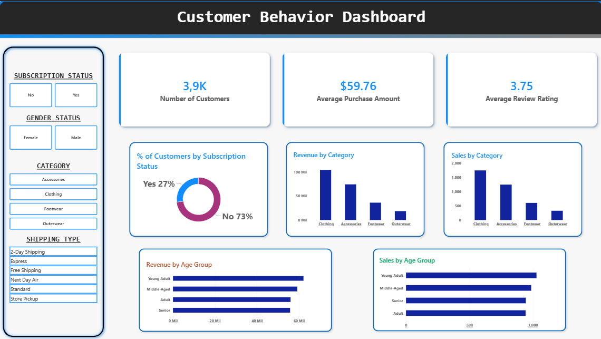

# 🛒 Customer Shopping Behavior Analysis

> 🇧🇷 Leia em Português abaixo.

<p align="center">


</p>

[Dashboard](https://app.powerbi.com/view?r=eyJrIjoiY2UzNWIyZmMtNzJhMS00YWQwLWI4OWEtMGM3OGIzNDI4NmJhIiwidCI6Ijg4ZDAwMzRjLTViNDctNGNkNy1iOTU2LTk0NjdlODY2MjM3NyJ9&embedImagePlaceholder=true)

<p align="center">
  
</p>
---

# 📊 Overview

**Customer Shopping Behavior Analysis** is an end-to-end Data Analytics project that transforms raw retail transaction data into actionable business insights.

The project demonstrates a complete analytics workflow, including data cleaning with Python, Exploratory Data Analysis (EDA), SQL analysis using PostgreSQL, interactive dashboard development in Power BI, and the creation of a technical report and executive presentation.

Rather than focusing only on charts, this project showcases the entire process of preparing, analyzing and communicating data for business decision-making.

---

# 🎯 Project Objectives

- Clean and preprocess raw retail transaction data
- Perform Exploratory Data Analysis (EDA)
- Load the processed dataset into PostgreSQL
- Answer business questions using SQL
- Build an interactive Power BI dashboard
- Generate business insights and recommendations
- Present findings through a technical report and presentation

---

# 📁 Dataset

The dataset contains approximately **3,900 customer purchase records**, including demographic, transactional and behavioral information.

### Main attributes

- Customer demographics
- Purchase history
- Product categories
- Subscription status
- Discounts and promotions
- Product ratings
- Shipping methods
- Purchase frequency

After preprocessing, the cleaned dataset was loaded into PostgreSQL for analytical querying.

---

# 🛠 Tech Stack

### Programming Languages

- Python
- SQL

### Libraries

- Pandas
- NumPy

### Database

- PostgreSQL

### Data Visualization

- Power BI

### Development Environment

- Jupyter Notebook
- Visual Studio Code

### Documentation

- Microsoft Word
- Gamma

### Version Control

- Git
- GitHub

---

# 🔄 Project Workflow

## 1. Data Preparation

Using Python and Pandas:

- Imported the dataset
- Performed Exploratory Data Analysis (EDA)
- Handled missing values
- Standardized column names
- Created analytical features
- Removed redundant information
- Exported the cleaned dataset to PostgreSQL

---

## 2. SQL Analysis

Business questions explored include:

- Revenue by gender
- High-spending customers using discounts
- Top-rated products
- Shipping method comparison
- Subscribers vs. non-subscribers
- Discount dependency by product
- Customer segmentation
- Top-selling products by category
- Repeat buyers and subscription behavior
- Revenue by age group

---

## 3. Dashboard Development

An interactive Power BI dashboard was created to communicate business insights through intuitive visualizations.

The dashboard includes:

- Sales KPIs
- Customer segmentation
- Product performance
- Revenue analysis
- Subscription insights
- Purchase behavior
- Interactive filters

---

## 4. Business Recommendations

Based on the analysis, recommendations include:

- Increase subscription adoption
- Strengthen customer loyalty programs
- Optimize discount strategies
- Promote highly rated products
- Focus marketing efforts on high-value customer segments

---

# 📈 Project Deliverables

- Cleaned Dataset
- Python Data Cleaning Scripts
- Exploratory Data Analysis (EDA)
- SQL Business Queries
- PostgreSQL Database
- Interactive Power BI Dashboard
- Technical Report
- Executive Presentation

---

# 🚀 How to Run

Clone the repository

```bash
git clone https://github.com/leo-gouvea/customer-shopping-behavior-analysis.git
```

Install the required dependencies

```bash
pip install -r requirements.txt
```

Open the Jupyter Notebook and run the analysis.

Execute the SQL queries in PostgreSQL.

Open the Power BI dashboard (.pbix) to explore the visualizations.

Then:

1. Run the Python scripts.
2. Import the processed dataset into PostgreSQL.
3. Execute the SQL queries.
4. Open the Power BI dashboard (.pbix).

---

# 📚 Skills Demonstrated

- Data Cleaning
- Exploratory Data Analysis
- SQL Query Development
- PostgreSQL
- Data Visualization
- Dashboard Design
- Business Intelligence
- Analytical Storytelling
- Technical Documentation
- Business Reporting

---

# 🇧🇷 Customer Shopping Behavior Analysis

## 📊 Visão Geral

**Customer Shopping Behavior Analysis** é um projeto completo de Análise de Dados que transforma dados brutos de transações do varejo em informações relevantes para apoiar a tomada de decisões.

O projeto demonstra todo o fluxo de trabalho de Analytics, incluindo limpeza de dados com Python, Análise Exploratória de Dados (EDA), consultas SQL utilizando PostgreSQL, desenvolvimento de um dashboard interativo no Power BI e elaboração de um relatório técnico e apresentação executiva.

Mais do que criar gráficos, o objetivo foi demonstrar todo o processo de preparação, análise e comunicação de dados para gerar valor para o negócio.

---

# 🎯 Objetivos

- Limpar e preparar os dados
- Realizar Análise Exploratória de Dados (EDA)
- Armazenar os dados tratados no PostgreSQL
- Responder perguntas de negócio utilizando SQL
- Construir um dashboard interativo no Power BI
- Gerar insights e recomendações de negócio
- Apresentar os resultados por meio de relatório e apresentação

---

# 📁 Dataset

O conjunto de dados possui aproximadamente **3.900 registros de compras**, contendo informações demográficas, transacionais e comportamentais dos clientes.

### Principais atributos

- Dados demográficos
- Histórico de compras
- Categorias de produtos
- Status de assinatura
- Descontos e promoções
- Avaliações dos produtos
- Métodos de envio
- Frequência de compras

Após o tratamento, os dados foram carregados no PostgreSQL para análise em SQL.

---

# 🛠 Tecnologias

### Linguagens

- Python
- SQL

### Bibliotecas

- Pandas
- NumPy

### Banco de Dados

- PostgreSQL

### Visualização de Dados

- Power BI

### Ambiente de Desenvolvimento

- Jupyter Notebook
- Visual Studio Code

### Documentação

- Microsoft Word
- Gamma

### Versionamento

- Git
- GitHub

---

# 🔄 Fluxo do Projeto

## 1. Preparação dos Dados

Utilizando Python e Pandas:

- Importação do dataset
- Análise Exploratória de Dados (EDA)
- Tratamento de valores ausentes
- Padronização das colunas
- Criação de novas variáveis analíticas
- Remoção de informações redundantes
- Exportação dos dados tratados para PostgreSQL

---

## 2. Análise em SQL

Foram respondidas diversas perguntas de negócio, incluindo:

- Receita por gênero
- Clientes com alto gasto utilizando descontos
- Produtos mais bem avaliados
- Comparação entre métodos de envio
- Assinantes versus não assinantes
- Produtos mais dependentes de descontos
- Segmentação de clientes
- Produtos mais vendidos por categoria
- Compradores recorrentes e assinaturas
- Receita por faixa etária

---

## 3. Dashboard

Foi desenvolvido um dashboard interativo no Power BI contendo:

- KPIs de vendas
- Segmentação de clientes
- Desempenho de produtos
- Receita
- Informações sobre assinaturas
- Comportamento de compra
- Filtros interativos

---

## 4. Recomendações

Com base na análise, foram identificadas oportunidades para:

- Incentivar novas assinaturas
- Fortalecer programas de fidelidade
- Otimizar políticas de desconto
- Promover produtos mais bem avaliados
- Direcionar campanhas para clientes de maior valor

---

# 📈 Entregáveis

- Dataset tratado
- Scripts de limpeza em Python
- Análise Exploratória de Dados (EDA)
- Consultas SQL
- Banco PostgreSQL
- Dashboard Power BI
- Relatório Técnico
- Apresentação Executiva

---

# 🚀 Como Executar

Clone o repositório

```bash
git clone https://github.com/leo-gouvea/customer-shopping-behavior-analysis.git
```

Instale as dependências necessárias

```bash
pip install -r requirements.txt
```

Abra o Jupyter Notebook e execute a análise.

Execute as consultas SQL no PostgreSQL.

Abra o dashboard do Power BI (.pbix) para explorar as visualizações.

---

# 📚 Competências Demonstradas

- Limpeza de Dados
- Análise Exploratória de Dados
- SQL
- PostgreSQL
- Business Intelligence
- Power BI
- Storytelling com Dados
- Desenvolvimento de Dashboards
- Documentação Técnica
- Relatórios Gerenciais
